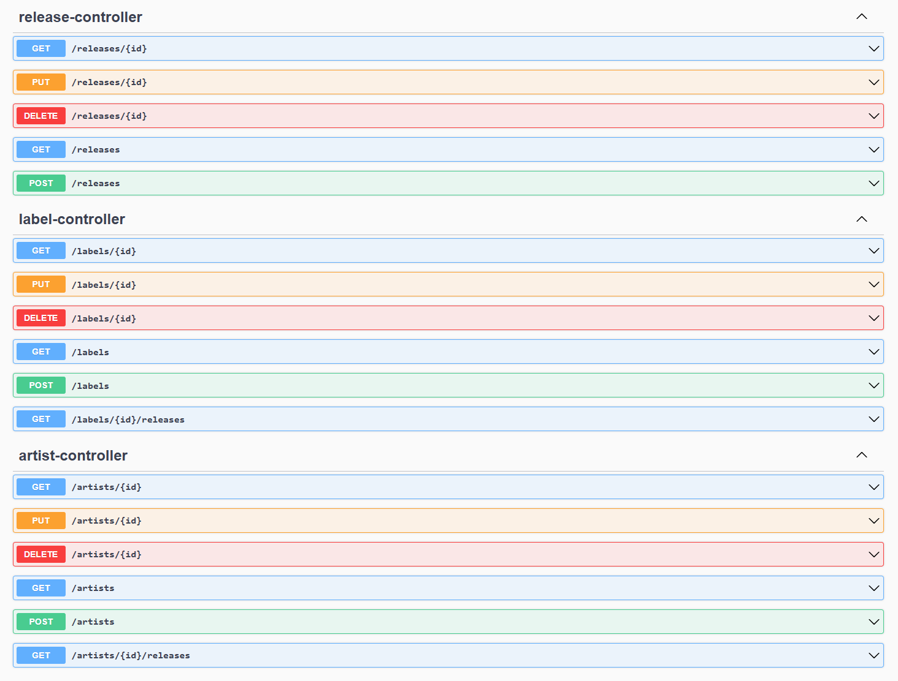
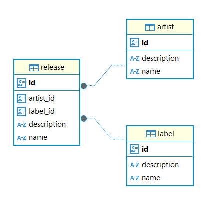

## Music

This is a simple REST API built with Spring Boot for managing music-related entities: releases, artists, and labels.

The app provides CRUD (Create, Read, Update, Delete) operations for all entities and interacts with a PostgreSQL database.

### Getting started

#### Requirements:
- Java
- Maven
- PostgreSQL

#### Quick start:

1. **Clone the Repository**
```bash
git clone https://github.com/juregvoz/music
```

2. **Setup Database**
- Make sure you have PostgreSQL installed and running
- Create database named **_music_dev_**

3. **Open Repository in Intellij**
- In **_application-dev.yaml_** file set _**ddl-auto**_ to _**create**_ ( just when running the app for the first time so Hibernate can create database tables )
- Set username and password in that same file or as environment variables
- Run the application with dev profile

### Live API documentation
When application is running you can access Swagger UI on http://localhost:8081/swagger-ui/index.html.

There you can see the example request and response payloads and call API in a simple way.



### Database Diagram


